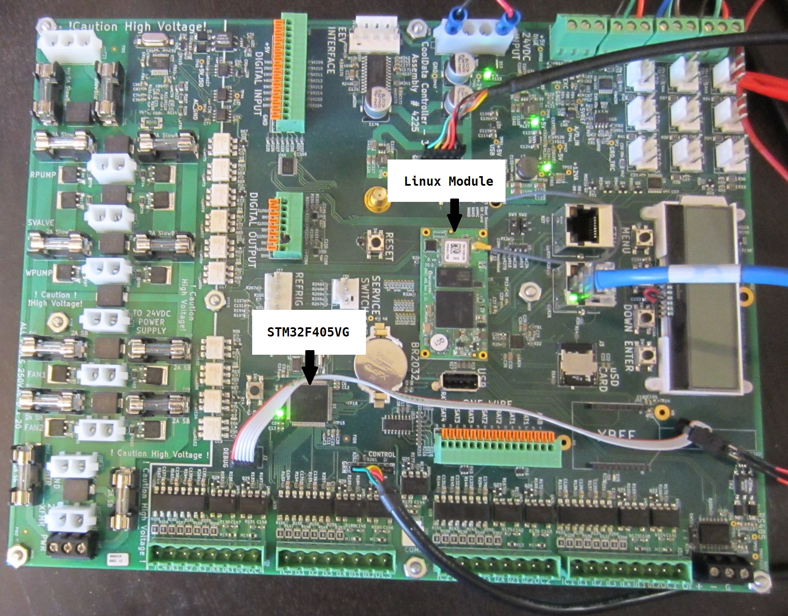

---

# Dean's Industrial Board

A ruggedized industrial controller with a Linux SOM added for Comms/IoT.

The 2 processor's are:

   1.  For Control:  STM32F405VG, running FreeRTOS

   2.  For Comms:  Variscite Dart 6ul SOM, running UbuntuBase, 16.04

---

